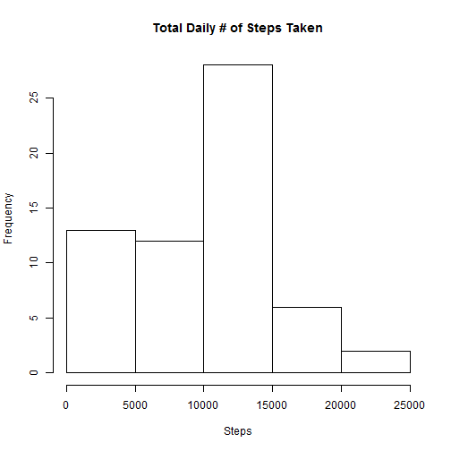
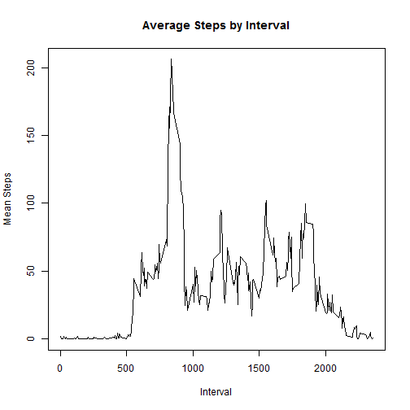
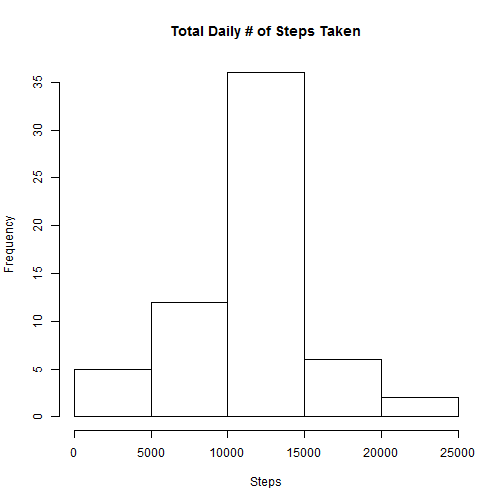
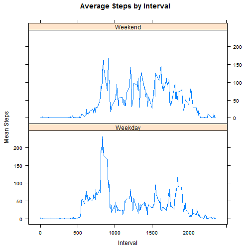

## Loading and preprocessing the data

First, read in the data and transform the date colume to Date format.


```r
actData <- read.csv("activity.csv", header = TRUE, stringsAsFactors = FALSE)
actData <-  actData <- transform(actData, date = as.Date(date, "%Y-%m-%d"))
```

## What is mean total number of steps taken per day?

Using dplyr package, group the day by date and sum the total steps taken each day. Use this to create a histogram.


```r
library(dplyr)
daySums <- tbl_df(actData[,1:2]) %>%
			group_by(date) %>%
			summarise_each(funs(sumNA = sum(., na.rm = TRUE)))
hist(daySums$steps, main = "Total Daily # of Steps Taken", xlab = "Steps")
```

 

From the grouped sums calculated the mean and median number of steps taken, removing NA values.


```r
mean(daySums$steps, na.rm = TRUE)
```

```
## [1] 9354.23
```

```r
median(daySums$steps, na.rm = TRUE)
```

```
## [1] 10395
```

## What is the average daily activity pattern?

Using the dplyr package again, group the activity data by interval and calculate the mean steps for each interval.
Use the base plotting systems to plot the average steps taken during each interval.


```r
intvMeans <- tbl_df(actData[,-2]) %>%
			group_by(interval) %>%
			summarise_each(funs(mnNA = mean(., na.rm = TRUE)))
plot(intvMeans, type = "l", 
	main = "Average Steps by Interval", ylab = "Mean Steps", 
	xlab = "Interval")
```

 

From the grouped means, calculate the interval with the greatest average number of steps.


```r
intvMeans[intvMeans$steps == max(intvMeans$steps),]
```

```
## Source: local data frame [1 x 2]
## 
##     interval    steps
## 104      835 206.1698
```

## Imputing missing values

Determine the number of missing values and cache their locations. 


```r
naVals <- is.na(actData$steps)
sum(naVals) 
```

```
## [1] 2304
```

Replace the missing values with the mean value for the that interval.


```r
actDataImp <- actData
impVals <- merge(intvMeans, actDataImp[naVals, 2:3])[,c("steps", "date", "interval")]
actDataImp[naVals, ] <- impVals[order(impVals$date, impVals$interval),]
```

Recalculate the daily total number of steps with the revised data and plot the updated histogram.


```r
impDaySums <- tbl_df(actDataImp[,1:2]) %>%
			group_by(date) %>%
			summarise_each(funs(sumNA = sum(., na.rm = TRUE)))
hist(impDaySums$steps, main = "Total Daily # of Steps Taken", xlab = "Steps")
```

 

Recalculate the mean and median number of steps taken. 


```r
mean(impDaySums$steps)
```

```
## [1] 10766.19
```

```r
median(impDaySums$steps)
```

```
## [1] 10766.19
```

We see both values have increased, which follows since replacing the missing values added steps to daily totals.

## Are there differences in activity patterns between weekdays and weekends?

Add a column to the activity data (the set with the missing values replaced) to indicate 
if each date is either a weekday or weekend.


```r
actDataImp <- transform(actDataImp, day =weekdays(date))
actDataImp <- transform(actDataImp, weekday = ifelse((day == "Saturday") | 
		(day == "Sunday"), "Weekend", "Weekday"))
```

Using dplyr, group the data by interval for the weekdays and weekends.
Using the lattice plotting system, compare  the average number of steps 
for each interval on weekdays and weekends. 


```r
wkdIntMeans <- tbl_df(actDataImp[,c(-2,-4)]) %>%
			group_by(interval, weekday) %>%
			summarise_each(funs(mean))
			
library(lattice)

xyplot(steps ~ interval | weekday, type = "l", data = wkdIntMeans, 
	main = "Average Steps by Interval", ylab = "Mean Steps", 
	xlab = "Interval", layout = c(1,2))
```

 

